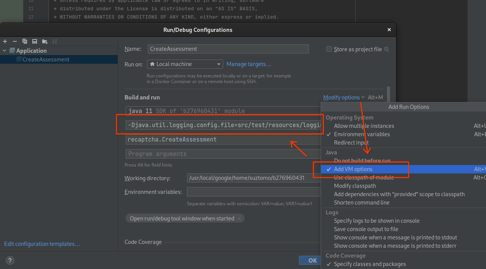

# Troubleshooting

## Logging

Our libraries use the Java logging API via `java.util.logging` package.
Configuring logging level reveals various facts that help your troubleshooting,
including:

- The timing of underlying client-server communication
- Request and response message headers
- Verbose messages in underlying dependency libraries

While there are various ways to configure the logging,
to quickly enable verbose logging for the Google Cloud Java libraries, create
a file `logging.properties` with the following content:

```
# run java program pointing to this properties file with the java arg
#   -Djava.util.logging.config.file=path/to/logging.properties
handlers=java.util.logging.ConsoleHandler
java.util.logging.SimpleFormatter.format=%1$tF %1$tT,%1$tL %4$-8s %3$-50s - %5$s %6$s%n

# --- ConsoleHandler ---
java.util.logging.ConsoleHandler.level=ALL
java.util.logging.ConsoleHandler.formatter=java.util.logging.SimpleFormatter
.level=INFO

# --- Specify logging level for certain packages ---
# com.google.api is for HTTP 1.1 layer
com.google.api.level=ALL
# io.grpc is for gRPC + Netty layer
io.grpc.level=FINE
# com.google.auth is for authentication
com.google.auth.level=FINE

# Example when we want to specify storge library's level. This works when
# the target Cloud library uses the logging API.
com.google.cloud.storage.level=INFO
```

and run your application with `-Djava.util.logging.config.file=path/to/logging.properties`
as the "VM argument" (not "Program argument").

If you use IntelliJ, you specify the VM argument in "Run/Debug Configuration":



If the JVM of your program is running with the configuration correctly, you see
the FINE-level logging in your console. Example output:

```
2023-04-05 13:03:01,761 FINE     com.google.auth.oauth2.DefaultCredentialsProvider  - Attempting to load credentials from well known file: /usr/local/google/home/suztomo/.config/gcloud/application_default_credentials.json
2023-04-05 13:03:01,847 FINE     io.grpc.ManagedChannelRegistry                     - Unable to find OkHttpChannelProvider
java.lang.ClassNotFoundException: io.grpc.okhttp.OkHttpChannelProvider
	at java.base/jdk.internal.loader.BuiltinClassLoader.loadClass(BuiltinClassLoader.java:581)
	at java.base/jdk.internal.loader.ClassLoaders$AppClassLoader.loadClass(ClassLoaders.java:178)
	at java.base/java.lang.ClassLoader.loadClass(ClassLoader.java:522)
	at java.base/java.lang.Class.forName0(Native Method)
	at java.base/java.lang.Class.forName(Class.java:315)
...
```

Note that you may see many stacktraces printed there.
As long as it's "FINE" level, they are not errors.

This is just one way to configure logging level.
For more details about Java logging API usage, see [Java Logging Overview](
https://docs.oracle.com/javase/8/docs/technotes/guides/logging/overview.html).

## ALPN is not configured properly

If you see exceptions related to `ALPN is not configured properly`, such as:

```
Caused by: java.lang.IllegalArgumentException: ALPN is not configured properly. See https://github.com/grpc/grpc-java/blob/master/SECURITY.md#troubleshooting for more information.
```

Please use the [compatibility checker](https://github.com/googleapis/google-cloud-java/tree/master/google-cloud-util/google-cloud-compat-checker) to see if your environment is compatible with grpc-based clients. The incompatibility can mean that:
- You are not on a [supported platform](https://github.com/googleapis/google-cloud-java/#supported-platforms).
- There are classpath conflicts with `netty`.
- Or, you are seeing any of the conflicts specified in [gRPC Troubleshooting guide](https://github.com/grpc/grpc-java/blob/master/SECURITY.md#troubleshooting).

## ClassNotFoundException, NoSuchMethodError, NoClassDefFoundError

These errors are usually caused by having multiple versions or conflicting versions of the same dependency in the classpath.
Usually these dependency conflicts occur with `guava` or `protobuf-java`.

There may be multiple sources for classpath conflicts:
- Multiple versions of the same transitive dependency in the dependency tree
- Your runtime classpath has different versions of dependencies than what you specified in the build

For example, if you have a direct or a transitive dependency on Guava version 19.0, 
and `google-cloud-java` uses Guava version 30.0, 
then `google-cloud-java` could be using Guava methods that don't exist in Guava 19.0,
and cause `NoSuchMethodError`.

Similarily, if your classpath has an older version of `protobuf-java`, 
but `google-cloud-java` requires a newer version,
 then you might see `NoClassDefFoundError` that fails to initialize `google-cloud-java` classes. For example:

```
java.lang.NoClassDefFoundError: Could not initialize class com.google.pubsub.v1.PubsubMessage$AttributesDefaultEntryHolder
```

### Validate the conflict

Check the dependency tree to see if you have multiple versions of the same dependencies:

```
$ mvn dependency:tree
```

Look for versions of potentially conflicting dependencies like `guava`, `protobuf-java`, etc.

If you experience the error only during runtime, then your runtime environment
might  be introducing conflicting JARs into your runtime classpath. A typical case
is that Hadoop, Spark, or other server software that your application runs on
has conflicting versions `netty`, `guava`, or `protobuf-java` JARs in the classpath.

### Detecting conflicts during build

To detect dependency linkage errors at compile time, add the 
[Linkage Checker Enforcer Rule](https://github.com/GoogleCloudPlatform/cloud-opensource-java/tree/master/enforcer-rules)
in your pom.xml:

```
      <plugin>
        <groupId>org.apache.maven.plugins</groupId>
        <artifactId>maven-enforcer-plugin</artifactId>
        <version>3.0.0-M3</version>
        <dependencies>
          <dependency>
            <groupId>com.google.cloud.tools</groupId>
            <artifactId>linkage-checker-enforcer-rules</artifactId>
            <version>1.5.7</version>
          </dependency>
        </dependencies>
        <executions>
          <execution>
            <id>enforce-linkage-checker</id>
            <!-- Important! Should run after compile -->
            <phase>verify</phase>
            <goals>
              <goal>enforce</goal>
            </goals>
            <configuration>
              <rules>
                <LinkageCheckerRule
                    implementation="com.google.cloud.tools.dependencies.enforcer.LinkageCheckerRule"/>
              </rules>
            </configuration>
          </execution>
        </executions>
      </plugin>
```

There is no way to detect runtime classpath conflicts though. You need to be fully
aware of which JARs/classes are included in the runtime classpath
as every server environment is different.

### Resolving the conflict

There are different strategies to resolve conflicts, but you must understand the root cause of the conflicts. For example:

- If you have control over the dependency tree, upgrade
  offending dependencies (for example, upgrading Guava version). This is the 
  least hackish approach, but it is a lot of work that can require multiple releases
   of multiple libraries to sync everything up. 
- If you can't modify and push new versions of your dependencies, import
  `com.google.cloud:libraries-bom:25.1.0` (or a more recent version) and use that to
  select consistent dependency versions. This is the easiest route. 
  For example, this is how you can depend on consistent versions of Guava and 
  `com.google.cloud:google-cloud-storage` without explicitly setting the version of either one:
  
```
  ...
  <dependencyManagement>
    <dependencies>
      <dependency>
        <groupId>com.google.cloud</groupId>
        <artifactId>libraries-bom</artifactId>
        <version>25.1.0</version>
        <type>pom</type>
        <scope>import</scope>
       </dependency>
     </dependencies>
  </dependencyManagement>
  ...
  <dependencies>
    <dependency>
      <groupId>com.google.cloud</groupId>
      <artifactId>google-cloud-storage</artifactId>
    </dependency>
    <dependency>
      <groupId>com.google.guava</groupId>
      <artifactId>guava</artifactId>
    </dependency>
    ...
  </dependencies>
  ...
```

- The release note of the libraries-bom shows the compatible dependency libraries.
  For example, https://github.com/googleapis/java-cloud-bom/releases/tag/v26.31.0 shows
  
  > These client libraries are built with the following Java libraries:
  >
  > - Guava: 32.1.3-jre
  > - Protobuf Java: 3.25.2
  > - Google Auth Library: 1.22.0
  > - Google API Client: 2.2.0
  > - gRPC: 1.61.0
  > - GAX: 2.41.0
  > - Google Cloud Core: 2.31.0
  
  By examining the dependency graph of your project (`mvn dependency:tree -Dverbose`
  or `gradle dependencies`), you may find some of the dependencies having unexpected
  versions. They might cause dependency conflicts.

- If changing dependency versions causes other failures, 
  consider [shading dependencies](https://maven.apache.org/plugins/maven-shade-plugin/)
  that conflict with Google Cloud Java libraries.

  For example, to shade `guava` and `protobuf-java`:

```
  <plugin>
    <groupId>org.apache.maven.plugins</groupId>
    <artifactId>maven-shade-plugin</artifactId>
    <version>...</version>
    <executions>
      <execution>
        <phase>package</phase>
        <goals>
          <goal>shade</goal>
        </goals>
        <configuration>
          <keepDependenciesWithProvidedScope>false</keepDependenciesWithProvidedScope>
          <relocations>
            <!-- move protobuf to a shaded package -->
            <relocation>
              <pattern>com.google.protobuf</pattern>
              <shadedPattern>myapp.shaded.com.google.protobuf</shadedPattern>
            </relocation>
            <!-- move Guava to a shaded package -->
            <relocation>
              <pattern>com.google.common</pattern>
              <shadedPattern>myapp.shaded.com.google.common</shadedPattern>
            </relocation>
          </relocations>
        </configuration>
      </execution>
    </executions>
  </plugin>
```
