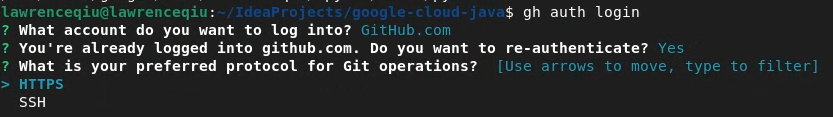

# New Google Client Library Generation

The script allows you to create a new client library module in the
google-cloud-java monorepo.

**This tool is for repository maintainers only. Not for library users.**

## Prerequisites

This section is only needed for the first run of this script. If it's already
done, go to "Run client generation script" section.


### Environment

Use Linux environment.

Install Docker.

### Checkout google-cloud-java repository

```
$ git clone https://github.com/googleapis/google-cloud-java
$ git checkout main
$ git pull
```

### Install pyenv

Install pyenv

```
curl -L https://github.com/pyenv/pyenv-installer/raw/master/bin/pyenv-installer \
| bash
```

Append the following lines to `$HOME/.bashrc`.

```
export PYENV_ROOT="$HOME/.pyenv"
command -v pyenv >/dev/null || export PATH="$PYENV_ROOT/bin:$PATH"
eval "$(pyenv init -)"
eval "$(pyenv virtualenv-init -)"
```

Logout the shell and login again.
Assuming you have the following folder structure:
```
~ (Home)
    -> IdeaProjects/
        -> google-cloud-java
```
You should run these next commands in the home directory. Otherwise, run it at `google-cloud-java`'s parent directory.

Confirm pyenv installation succeeded:

```
suztomo@suztomo:~$ pyenv
pyenv 2.3.4
Usage: pyenv <command> [<args>]

Some useful pyenv commands are:
   activate    Activate virtual environment
   commands    List all available pyenv commands
   deactivate   Deactivate virtual environment
...
```

### Install Python 3.9 via pyenv

```
suztomo@suztomo:~$ pyenv install 3.9.13
Downloading Python-3.9.13.tar.xz...
-> https://www.python.org/ftp/python/3.9.13/Python-3.9.13.tar.xz
Installing Python-3.9.13...
WARNING: The Python sqlite3 extension was not compiled. Missing the SQLite3 lib?
Installed Python-3.9.13 to /usr/local/google/home/suztomo/.pyenv/versions/3.9.13
```

### Install Python v3.9.13 locally

Run this command

```
$ pyenv local 3.9.13
```


Confirm `python3.9` command is available:
```
$ which python3.9
/usr/local/google/home/suztomo/.pyenv/shims/python3.9
```

### Install Python packages

At the root of google-cloud-java repository clone, run:

```
$ python3.9 -m pip install -r generation/new_client/requirements.txt
```

### Install GitHub CLI (Optional)

Install the GitHub CLI and login, if needed (may help with `Common Errors` below:

```
$ sudo apt-get install gh
$ gh auth login
```

## Run client generation script

You will run new-client.py script with the following parameters.
Collect them from the ticket before running the command.

### API short name

For convenience of the subsequent commands, define a variable for API short name.
Get the value from the DevRel Services page (Example: `apikeys`):

### Proto path

The script takes "proto path" parameter. This is path from google3's root to the
directory that contains versions (e.g., "v1" or "v2"). For example, if we
have 

> Link to protos: http://google3/google/api/apikeys/v2/apikeys.proto

then the "proto path" value we supply to the command is "google/api/apikeys".

### Name pretty

Pick name from the display name in the DevRel Services site.
For example, "API Keys API" in
https://devrel.corp.google.com/admin/products/479.

### Product Docs

Find product document URL in the DevRel Services site.
For example, "https://cloud.google.com/api-keys/" in
https://devrel.corp.google.com/admin/products/479.
The value must starts with "https://".

### API description

Find the short description of the API. Usually the first sentence in the product
document above.

### Example arguments

Run `new-client.py` with the arguments above:

```
$ python3.9 generation/new_client/new-client.py generate \
  --api_shortname=apikeys \
  --proto-path=google/api/apikeys \
  --name-pretty="API Keys API" \
  --product-docs="https://cloud.google.com/api-keys/" \
  --api-description="API Keys lets you create and manage your API keys for your projects."
```

The command creates changes for
the new module in the monorepo. At the end (~ 10 minutes), it tells you to
create a pull request in the monorepo:

```
...
Please create a pull request:
  $ git checkout -b new_module_java-discoveryengine
  $ git add .
  $ git commit -m 'feat: [apikeys] new module for apikeys'
  $ gh pr create --title 'feat: [apikeys] new module for apikeys'
```

Create a pull request from the change.

# Principles

The script should finish creating a pull request even when the newly created
module fails to compile. This gives the user flexibility to fix things in the
created pull request.

# Common Errors

## Unable to clone googleapis-gen
```
Creating a new module /usr/local/google/home/lawrenceqiu/IdeaProjects/google-cloud-java/java-vmwareengine
gcr.io/cloud-devrel-public-resources/owlbot-java:latest
Cloning googleapis-gen...
Username for 'https://github.com': xxxxxx
Password for 'https://xxxxxx@github.com': ******
remote: Support for password authentication was removed on August 13, 2021.
remote: Please see https://docs.github.com/en/get-started/getting-started-with-git/about-remote-repositories#cloning-with-https-urls for information on currently recommended modes of authentication.
fatal: Authentication failed for 'https://github.com/googleapis/googleapis-gen.git/'
Traceback (most recent call last):
  File "/usr/local/google/home/lawrenceqiu/IdeaProjects/google-cloud-java/generation/new_client/new-client.py", line 291, in <module>
    main()
  File "/usr/local/google/home/lawrenceqiu/.local/lib/python3.9/site-packages/click/core.py", line 1130, in __call__
    return self.main(*args, **kwargs)
  File "/usr/local/google/home/lawrenceqiu/.local/lib/python3.9/site-packages/click/core.py", line 1055, in main
    rv = self.invoke(ctx)
  File "/usr/local/google/home/lawrenceqiu/.local/lib/python3.9/site-packages/click/core.py", line 1657, in invoke
    return _process_result(sub_ctx.command.invoke(sub_ctx))
  File "/usr/local/google/home/lawrenceqiu/.local/lib/python3.9/site-packages/click/core.py", line 1404, in invoke
    return ctx.invoke(self.callback, **ctx.params)
  File "/usr/local/google/home/lawrenceqiu/.local/lib/python3.9/site-packages/click/core.py", line 760, in invoke
    return __callback(*args, **kwargs)
  File "/usr/local/google/home/lawrenceqiu/IdeaProjects/google-cloud-java/generation/new_client/new-client.py", line 180, in generate
    subprocess.check_call(["git", "clone", "-q", googleapis_gen_url, "./gen/googleapis-gen"], cwd=workdir)
  File "/usr/local/google/home/lawrenceqiu/.pyenv/versions/3.9.13/lib/python3.9/subprocess.py", line 373, in check_call
    raise CalledProcessError(retcode, cmd)
subprocess.CalledProcessError: Command '['git', 'clone', '-q', 'https://github.com/googleapis/googleapis-gen.git', './gen/googleapis-gen']' returned non-zero exit status 128.
```
### Solution
Run `gh auth login` and choose to authenticate with HTTPS. You may already be authenticated with SSH.


##
Owl-bot Staging Directory Not Found
```
Removing googleapis-gen...
mv: cannot stat 'owl-bot-staging': No such file or directory
Traceback (most recent call last):
  File "/usr/local/google/home/lawrenceqiu/IdeaProjects/google-cloud-java/generation/new_client/new-client.py", line 291, in <module>
    main()
  File "/usr/local/google/home/lawrenceqiu/.local/lib/python3.9/site-packages/click/core.py", line 1130, in __call__
    return self.main(*args, **kwargs)
  File "/usr/local/google/home/lawrenceqiu/.local/lib/python3.9/site-packages/click/core.py", line 1055, in main
    rv = self.invoke(ctx)
  File "/usr/local/google/home/lawrenceqiu/.local/lib/python3.9/site-packages/click/core.py", line 1657, in invoke
    return _process_result(sub_ctx.command.invoke(sub_ctx))
  File "/usr/local/google/home/lawrenceqiu/.local/lib/python3.9/site-packages/click/core.py", line 1404, in invoke
    return ctx.invoke(self.callback, **ctx.params)
  File "/usr/local/google/home/lawrenceqiu/.local/lib/python3.9/site-packages/click/core.py", line 760, in invoke
    return __callback(*args, **kwargs)
  File "/usr/local/google/home/lawrenceqiu/IdeaProjects/google-cloud-java/generation/new_client/new-client.py", line 212, in generate
    subprocess.check_call(
  File "/usr/local/google/home/lawrenceqiu/.pyenv/versions/3.9.13/lib/python3.9/subprocess.py", line 373, in check_call
    raise CalledProcessError(retcode, cmd)
subprocess.CalledProcessError: Command '['mv', 'owl-bot-staging', '../']' returned non-zero exit status 1.
```

### Solution
The proto path is incorrect. See the `Proto Path` section to find the correct path.

## Python3.9 is not Installed
```
pyenv: version `3.9.13' is not installed (set by /workspace/.python-version)
Traceback (most recent call last):
File "/usr/local/google/home/lawrenceqiu/IdeaProjects/google-cloud-java/generation/new_client/new-client.py", line 291, in <module>
main()
File "/usr/local/google/home/lawrenceqiu/.local/lib/python3.9/site-packages/click/core.py", line 1130, in __call__
return self.main(*args, **kwargs)
File "/usr/local/google/home/lawrenceqiu/.local/lib/python3.9/site-packages/click/core.py", line 1055, in main
rv = self.invoke(ctx)
File "/usr/local/google/home/lawrenceqiu/.local/lib/python3.9/site-packages/click/core.py", line 1657, in invoke
return _process_result(sub_ctx.command.invoke(sub_ctx))
File "/usr/local/google/home/lawrenceqiu/.local/lib/python3.9/site-packages/click/core.py", line 1404, in invoke
return ctx.invoke(self.callback, **ctx.params)
File "/usr/local/google/home/lawrenceqiu/.local/lib/python3.9/site-packages/click/core.py", line 760, in invoke
return __callback(*args, **kwargs)
File "/usr/local/google/home/lawrenceqiu/IdeaProjects/google-cloud-java/generation/new_client/new-client.py", line 223, in generate
subprocess.check_call(
File "/usr/local/google/home/lawrenceqiu/.pyenv/versions/3.9.13/lib/python3.9/subprocess.py", line 373, in check_call
raise CalledProcessError(retcode, cmd)
subprocess.CalledProcessError: Command '['docker', 'run', '--rm', '-v', '/usr/local/google/home/lawrenceqiu/IdeaProjects/google-cloud-java:/workspace', '--user', '1023638:89939', 'gcr.io/cloud-devrel-public-resources/owlbot-java']' returned non-zero exit status 1.
```

### Solution
You have run the `pyenv local 3.9.13` in the `google-cloud-java` repo.
1. Remove the `.python-version` file in `google-cloud-java`.
2. `cd ..` out to the parent directory and run `pyenv local 3.9.13` there
3. `cd google-cloud-java` back into the repo and run the generation script again