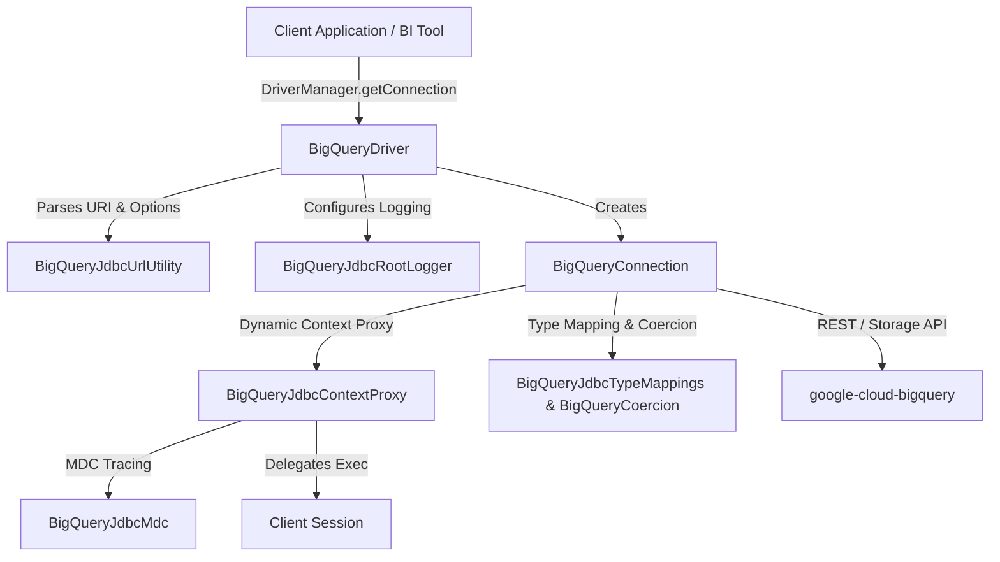

# BigQuery JDBC Developer & Contributor Guide

This guide details the architectural design, core abstractions, coding principles, and testing workflows for developers contributing to the `google-cloud-bigquery-jdbc` module.

---

## 1. Core Architecture & Component Map

The driver is structured to provide high performance, zero-allocation MDC log tracing, strict JDBC compliance, and seamless execution over the Google Cloud BigQuery REST and Storage APIs.



### Key Abstractions

- **`BigQueryDriver`**: JDBC entry point registered with `java.sql.DriverManager`. Intercepts `jdbc:bigquery://` URLs, initializes early logger state, and instantiates `BigQueryConnection`.
- **`BigQueryConnection`**: Represents an active BigQuery session, holding dataset defaults, connection configuration maps, and transaction/session state (`EnableSession=true`, `session_id`).
- **`BigQueryJdbcUrlUtility`**: Parses and validates connection string parameters using a bounded LRU parse cache (`PARSE_CACHE`) to avoid heavy allocations during frequent connection creation.
- **`BigQueryJdbcContextProxy`**: A dynamic proxy layer (`java.lang.reflect.Proxy`) wrapping JDBC statements, connections, and metadata. Intercepts calls to propagate ThreadLocal MDC parameters (`connectionId`) across execution threads and enforce state validation (`checkClosed()`).
- **`BigQueryJdbcTypeMappings` & `BigQueryCoercion`**: Centralized mapping logic handling standard JDBC-to-BigQuery SQL type mappings (`StandardSQLTypeName`) and object coercions (`Date`, `Timestamp`, `BigDecimal`, etc.).
- **`BigQueryArrowResultSet`**: Custom result set implementation accelerating large query result retrieval via the BigQuery Storage Read API gRPC stream.

---

## 2. Developer Guardrails & Rules of Engagement

> [!IMPORTANT]
> **Adhere strictly to the following guardrails when making code changes:**

1. **Visibility Principle**: Always default to the most restrictive access level (`private`, package-private, or `@InternalApi`). Do **NOT** expose classes or methods as `public` unless strictly required by standard JDBC interfaces.
2. **Explicit Class Imports**: Always write explicit `import` statements. Do **NOT** use wildcard star imports or inline fully qualified class names (e.g., use `import java.math.BigDecimal;` instead of `java.math.BigDecimal` inline).
3. **Logger Preference**: Always prefer `BigQueryJdbcCustomLogger` over `java.util.logging.Logger`. Format strings using `String.format(...)` before logging, as `BigQueryJdbcRootLogger` evaluates `record.getMessage()` directly.
4. **Exception Handling**: Always throw exceptions from the `com.google.cloud.bigquery.exception` package (`BigQueryJdbcException`, `BigQueryJdbcSqlSyntaxErrorException`, `BigQueryConversionException`).
5. **No Mocking of Final JDK Classes**: Do **NOT** mock final JDK types (`BigDecimal`, `LocalDate`, `Instant`, `UUID`) with Mockito. Mocking final JDK classes is unstable and can cause JVM crashes under JDK 21+. Always construct real instances in unit tests.

---

## 3. Build & Test Playbook

Builds and test tasks are managed via the module [Makefile](file:///usr/local/google/home/neenushaji/IdeaProjects/google-cloud-java/java-bigquery-jdbc/Makefile).

### Local Build Commands

```bash
# Build & install module locally
make install

# Clean project target directory
make clean

# Format code and check linter compliance
make lint
```

### Running Unit Tests

```bash
# Run all unit tests
make unittest

# Run a specific unit test class
make unittest test=BigQueryPreparedStatementTest

# Run a specific unit test method
make unittest test=BigQueryPreparedStatementTest#testSetObjectWithTemporalTypes
```

### Running Integration Tests

> [!WARNING]
> Integration tests connect to real GCP BigQuery resources and require valid GCP credentials.

```bash
# Set GCP service account credentials
export GOOGLE_APPLICATION_CREDENTIALS=/path/to/service-account-key.json

# Run a specific integration test
make integration-test test=ITBigQueryJDBCTest#testValidServiceAccountAuthenticationOAuthPvtKey
```

### Dockerized Execution

If local Java/Maven environments are not available, use the dockerized environment:

```bash
# Start an interactive shell session inside Docker container
make docker-session

# Run unit tests inside Docker
make docker-unittest
```

---

## 4. Logging Architecture & Developer Conventions

The driver uses a custom logging subsystem built on top of `java.util.logging`: `BigQueryJdbcCustomLogger` and `BigQueryJdbcRootLogger`.

### Instantiating Loggers

- **For Instance Components** (`BigQueryConnection`, `BigQueryStatement`, `BigQueryDatabaseMetaData`):
  Use `this.toString()` to include instance identity in logger output:
  ```java
  private final BigQueryJdbcCustomLogger LOG = new BigQueryJdbcCustomLogger(this.toString());
  ```
- **For Static / Utility Components** (`BigQueryJdbcUrlUtility`, `BigQueryJdbcTypeMappings`):
  Use the class name:
  ```java
  private static final BigQueryJdbcCustomLogger LOG = 
      new BigQueryJdbcCustomLogger(BigQueryJdbcTypeMappings.class.getName());
  ```

### Developer Logging Rules & Conventions

1. **Method Entry / Exit Tracing**:
   Methods at `FINER` level must log entrance and exit points:
   ```java
   public ResultSet executeQuery(String sql) throws SQLException {
     LOG.finer("++enter++");
     try {
       // ... execution logic ...
       return rs;
     } finally {
       LOG.finer("++exit++");
     }
   }
   ```
2. **Format Placeholders (Zero Allocation)**:
   Avoid string concatenation in log calls. Use formatting placeholders or `Supplier<String>` lambdas to prevent unneeded string allocation when the log level is disabled:
   ```java
   // Recommended: Use printf-style formatting
   LOG.fine("Executing query on dataset: %s, table: %s", datasetId, tableId);

   // Recommended: Use supplier lambda for expensive calculations
   LOG.fine(() -> "Parsed properties: " + complexObject.toDebugString());
   ```
3. **Caller Inference & MDC Propagation**:
   - `BigQueryJdbcCustomLogger` automatically wraps log records in `BigQueryJdbcLogRecord`, which inspects the stack trace to accurately infer caller class and method names.
   - `BigQueryJdbcMdc` maintains `connectionId` in a `ThreadLocal` context. When logging from proxy or worker threads, always ensure MDC context is preserved or propagated via `BigQueryJdbcContextProxy`.

---

## 5. Pre-PR Checklist

Before submitting a Pull Request:

- [ ] All new classes and methods use the narrowest possible visibility scope (`private` or package-private).
- [ ] No inline fully qualified names or wildcard star imports are present.
- [ ] All logger instances use `BigQueryJdbcCustomLogger`.
- [ ] Method entrance/exit logging (`++enter++` / `++exit++`) is included for complex internal routines.
- [ ] All method changes and feature additions are covered by corresponding JUnit 5 tests.
- [ ] Unit tests pass cleanly without Mockito `UnnecessaryStubbingException` warnings.
- [ ] All `Statement`, `ResultSet`, or `DatabaseMetaData` objects returned by public entry points are properly wrapped via `BigQueryJdbcContextProxy.wrap()`.
- [ ] Code formatting and linting pass via `make lint`.
