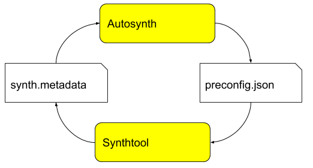

# Synthtool and Autosynth Protocol

**Synthtool** generates client library source code according to the currrent
state of the source repo, and upstream repos like 
[googleapis/googleapis](https://github.com/googleapis/googleapis).

**Autosynth** periodically runs Synthtool for each client library source repo.
Additionally, it repeatedly runs Synthtool in a binary search pattern to
discover which upstream change triggered a change in the generate code.

The proto files in this directory define the interface between.



**Synthtool** generates a file called `synth.metadata`, which contains a
json-encoded instance of the `Metadata` class defined in [metadata.proto](./metadata.proto).  `synth.metadata` tells Autosynth which git repos were pulled
by Synthtool while generating the library's source code.

**Autosynth** consumes `synth.metadata`.  Before invoking Synthtool again, it
observes which repos Synthtool used during the last generation, and
fetches them in advance.  Autosynth tells Synthtool where to find those repos
by generating a `preconfig.json` file.  

The `preconfig.json` file contains a Preconfig message as defined in
[preconfig.proto](./preconfig.proto).  Autosynth sets the environment variable
`SYNTHTOOL_PRECONFIG_FILE` to the path of the `preconfig.json` file so that
Synthtool can find it.

Here's a sample `preconfig.json` file:
```
{
  "preclonedRepos": {
    "https://github.com/googleapis/google-cloud-dotnet.git": "/tmpfs/src/git/autosynth/working_repo",
    "https://github.com/googleapis/googleapis.git": "/tmpfs/tmp/tmp4pusokpm/googleapis"
  }
}
```