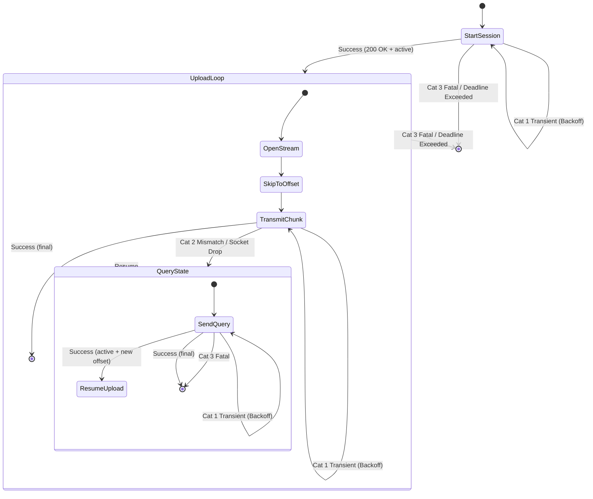

# Resumable Upload Protocol for Java: Design Document

This document proposes the architecture and design for integrating the Resumable Upload Protocol (RUP) into `gax-java` and the GAPIC code generator.

---

## 1. Design Principles and Requirements

1. **Veneer and GAPIC Aligned**: The solution must integrate cleanly into the existing `Callable` framework of `gax-java`.
2. **Stream-Safe Retries**: Java `InputStream` is forward-only. The design must provide a clean abstraction (`InputStreamProvider`) to recreate or seek the stream during recovery.
3. **Double-Loop Retry & Recovery**: Implements the precise Category 1 (transient) and Category 2 (state consistency) error classification with backoffs as described in the RUP specifications.
4. **Progress Reporting**: Supports asynchronous progress updates via a simple callback mechanism.
5. **No unnecessary chunking**: By default, uploads send the remaining bytes in one request (avoiding unnecessary memory buffering or chunk management).

---

## 2. API Design (`gax` Changes)

We introduce a new callable type and request/response wrappers in `com.google.api.gax.rpc`.

### 2.1. `InputStreamProvider`

To support seeking/rewinding, the stream source is wrapped in a functional interface that can supply fresh streams on retry:

```java
package com.google.api.gax.rpc;

import java.io.IOException;
import java.io.InputStream;

/** Provides a fresh {@link InputStream} for retriable upload operations. */
@FunctionalInterface
public interface InputStreamProvider {
  /** Returns a new {@link InputStream}. */
  InputStream get() throws IOException;
}
```

### 2.2. Progress Listener and Status

```java
package com.google.api.gax.rpc;

/** Listener for tracking progress of a resumable upload. */
public interface ResumableUploadProgressListener {
  
  enum State {
    NOT_STARTED,
    IN_PROGRESS,
    RECOVERING,
    COMPLETED,
    FAILED,
    CANCELLED
  }

  void onProgress(ResumableUploadStatus status);
}

/** Status details for progress updates. */
public final class ResumableUploadStatus {
  private final long bytesUploaded;
  private final long totalBytes;
  private final ResumableUploadProgressListener.State state;

  public ResumableUploadStatus(long bytesUploaded, long totalBytes, ResumableUploadProgressListener.State state) {
    this.bytesUploaded = bytesUploaded;
    this.totalBytes = totalBytes;
    this.state = state;
  }

  public long getBytesUploaded() { return bytesUploaded; }
  public long getTotalBytes() { return totalBytes; }
  public ResumableUploadProgressListener.State getState() { return state; }
}
```

### 2.3. Request Wrapper: `ResumableUploadRequest`

```java
package com.google.api.gax.rpc;

import com.google.common.base.Preconditions;

public final class ResumableUploadRequest<RequestT> {
  private final RequestT request;
  private final InputStreamProvider streamProvider;
  private final long totalBytes; // -1 if unknown
  private final ResumableUploadProgressListener progressListener;

  private ResumableUploadRequest(Builder<RequestT> builder) {
    this.request = Preconditions.checkNotNull(builder.request);
    this.streamProvider = Preconditions.checkNotNull(builder.streamProvider);
    this.totalBytes = builder.totalBytes;
    this.progressListener = builder.progressListener;
  }

  public RequestT getRequest() { return request; }
  public InputStreamProvider getStreamProvider() { return streamProvider; }
  public long getTotalBytes() { return totalBytes; }
  public ResumableUploadProgressListener getProgressListener() { return progressListener; }

  public static <RequestT> Builder<RequestT> newBuilder() {
    return new Builder<>();
  }

  public static class Builder<RequestT> {
    private RequestT request;
    private InputStreamProvider streamProvider;
    private long totalBytes = -1;
    private ResumableUploadProgressListener progressListener;

    public Builder<RequestT> setRequest(RequestT request) {
      this.request = request;
      return this;
    }
    public Builder<RequestT> setStreamProvider(InputStreamProvider streamProvider) {
      this.streamProvider = streamProvider;
      return this;
    }
    public Builder<RequestT> setTotalBytes(long totalBytes) {
      this.totalBytes = totalBytes;
      return this;
    }
    public Builder<RequestT> setProgressListener(ResumableUploadProgressListener progressListener) {
      this.progressListener = progressListener;
      return this;
    }
    public ResumableUploadRequest<RequestT> build() {
      return new ResumableUploadRequest<>(this);
    }
  }
}
```

### 2.4. Callable Wrapper: `ResumableUploadCallable`

```java
package com.google.api.gax.rpc;

import com.google.api.core.ApiFuture;

public abstract class ResumableUploadCallable<RequestT, ResponseT> {
  
  protected ResumableUploadCallable() {}

  public abstract ApiFuture<ResponseT> futureCall(
      ResumableUploadRequest<RequestT> request, ApiCallContext context);

  public ResponseT call(ResumableUploadRequest<RequestT> request, ApiCallContext context) {
    return ApiExceptions.callAndTranslateCharSequenceException(futureCall(request, context));
  }

  public ResponseT call(ResumableUploadRequest<RequestT> request) {
    return call(request, null);
  }
}
```

---

## 3. Transport Implementation (`gax-httpjson`)

The transport layer executes the actual HTTP protocol calls using the Google HTTP Client.

We introduce `HttpJsonResumableUploadCall` to coordinate the resumable upload state machine.

### 3.1. Error Categorization in Java

```java
private enum ErrorCategory {
  CATEGORY_1_TRANSIENT,  // 429, 500, 502, 503, 504, TCP/Socket Timeout
  CATEGORY_2_MISMATCH,   // 400, 412, 416
  CATEGORY_3_FATAL       // 401, 403, 404, etc.
}

private ErrorCategory getErrorCategory(Throwable t) {
  if (t instanceof HttpResponseException) {
    int statusCode = ((HttpResponseException) t).getStatusCode();
    if (statusCode == 429 || statusCode >= 500) {
      return ErrorCategory.CATEGORY_1_TRANSIENT;
    }
    if (statusCode == 400 || statusCode == 412 || statusCode == 416) {
      return ErrorCategory.CATEGORY_2_MISMATCH;
    }
  }
  if (t instanceof IOException) {
    // Socket timeouts, connection drops
    return ErrorCategory.CATEGORY_1_TRANSIENT;
  }
  return ErrorCategory.CATEGORY_3_FATAL;
}
```

### 3.2. Detailed Execution Flow (State Machine)

The `HttpJsonResumableUploadCall` runs inside the user's thread (or client executor pool for future execution) and implements the following flow:



#### Step 1: Start Session
- Build standard headers + merge user-provided metadata.
- Pre-emptively prefix headers that affect physical bodies (`Content-Length`, `Content-Type`, etc.) with `X-Goog-Upload-Header-`.
- Set `X-Goog-Upload-Protocol: resumable` and `X-Goog-Upload-Command: start`.
- Execute POST with the request JSON body.
- Extract `X-Goog-Upload-URL` header value to obtain the `uploadUrl`.

#### Step 2: Upload Loop (Transmit)
- Check absolute global deadline.
- Call `streamProvider.get()`.
- Skip/seek to current `offset`.
- Set `X-Goog-Upload-Command: upload, finalize` and `X-Goog-Upload-Offset: offset`.
- Stream payload using a chunked output stream, updating the progress listener during writes.
- If response is `final` with `2xx`: parse response and return.
- If exception occurs: Categorize exception. If Category 2 (Mismatch) or connection drop, transition to **Query State**.

#### Step 3: Query State
- Execute POST to `uploadUrl` with `X-Goog-Upload-Command: query`.
- If response is `active`:
  - Extract `X-Goog-Upload-Size-Received` -> `newOffset`.
  - If `newOffset == offset`: apply backoff (to avoid spamming server).
  - Update `offset = newOffset` and transition back to **Upload Loop**.
- If response is `final`: return response.
- If Category 1 (Transient) error: retry query with backoff.
- If Category 3 (Fatal) error: fail immediately.
